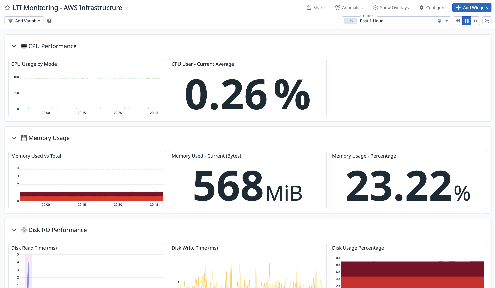
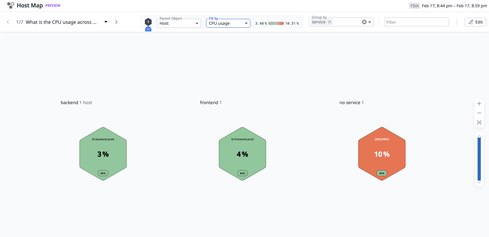
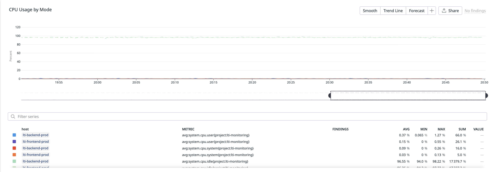
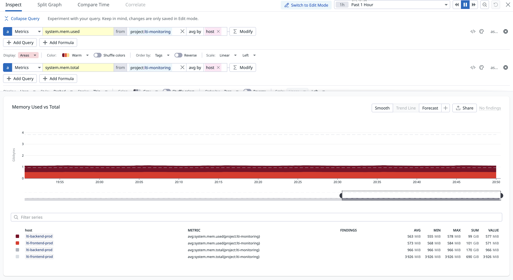
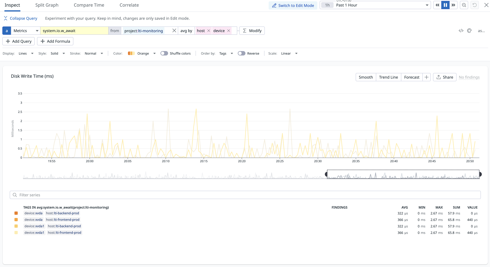

# 🔍 LTI Monitoring - AWS Infrastructure con Datadog


## 📋 Tabla de Contenidos

- [Introducción](#-introducción)
- [Arquitectura](#-arquitectura)
- [Cambios Realizados](#-cambios-realizados)
- [Prompt Engineering](#-prompt-engineering)
- [Desafíos y Soluciones](#-desafíos-y-soluciones)
- [Guía de Uso](#-guía-de-uso)
- [Evidencias](#-evidencias)
- [Estructura del Proyecto](#-estructura-del-proyecto)

---

## 🎯 Introducción

Este proyecto extiende la infraestructura existente de **LTI Recruiter** para implementar un sistema de **monitorización completo** utilizando **Datadog** como plataforma de observabilidad. La solución está completamente automatizada mediante **Infrastructure as Code (IaC)** con Terraform, garantizando reproducibilidad y trazabilidad.

### Objetivos del Proyecto

1. **Integración AWS-Datadog**: Configurar la conexión bidireccional entre AWS y Datadog mediante IAM Roles y External ID.
2. **Despliegue de Agentes**: Instalar Datadog Agent 7 en las instancias EC2 mediante scripts `user_data`.
3. **Visualización de Métricas**: Crear un dashboard personalizado con 15+ widgets organizados en 6 secciones temáticas.
4. **IaC Completo**: Toda la infraestructura definida en Terraform (reproducible y versionable).

### Stack Tecnológico

- **Cloud Provider**: AWS (us-east-1)
- **IaC**: Terraform 1.x
- **Monitoring**: Datadog Agent 7 (región EU)
- **Compute**: Amazon Linux 2 (AMI ami-075d39ebbca89ed55)
- **Identity**: AWS IAM + External ID para Datadog
- **Storage**: S3 para artefactos de código

---

## 🏗️ Arquitectura

### Diagrama de Componentes

```
┌─────────────────────────────────────────────────────────────────┐
│                      AWS Infrastructure                          │
├─────────────────────────────────────────────────────────────────┤
│                                                                   │
│  ┌─────────────────────┐        ┌─────────────────────┐        │
│  │ EC2 Backend         │        │ EC2 Frontend        │        │
│  │ i-0a06e794b5e6d4a92 │        │ i-0b392c10d66e0ce98 │        │
│  │ t2.micro            │        │ t2.medium           │        │
│  │ 54.91.78.197        │        │ 98.89.46.199        │        │
│  ├─────────────────────┤        ├─────────────────────┤        │
│  │ Datadog Agent 7     │        │ Datadog Agent 7     │        │
│  │ DD_SITE=EU          │        │ DD_SITE=EU          │        │
│  │ Tags: backend       │        │ Tags: frontend      │        │
│  │ Host: lti-backend   │        │ Host: lti-frontend  │        │
│  └──────────┬──────────┘        └──────────┬──────────┘        │
│             │                              │                     │
│  ┌──────────┴──────────────────────────────┴──────────┐        │
│  │         S3 Bucket (Code Artifacts)                  │        │
│  │  ai4devs-project-code-bucket-197538345061           │        │
│  │  - backend.zip                                      │        │
│  │  - frontend.zip                                     │        │
│  └─────────────────────────────────────────────────────┘        │
│                                                                   │
│  ┌─────────────────────────────────────────────────────┐        │
│  │              IAM Roles & Policies                    │        │
│  │  - ec2_role (S3 Read Access)                        │        │
│  │  - DatadogIntegrationRole (SecurityAudit Policy)    │        │
│  │    * Trust Policy: External ID = datadog_app_key    │        │
│  └─────────────────────────────────────────────────────┘        │
│                                                                   │
└───────────────────────────┬───────────────────────────────────────┘
                            │ HTTPS (Port 443)
                            │ Datadog Agent Metrics
                            ▼
         ┌──────────────────────────────────────────┐
         │       Datadog EU API                     │
         │       api.datadoghq.eu                   │
         │                                          │
         │  ┌────────────────────────────────────┐ │
         │  │   AWS Integration                  │ │
         │  │   Account: 197538345061            │ │
         │  │   Role: DatadogIntegrationRole     │ │
         │  └────────────────────────────────────┘ │
         │                                          │
         │  ┌────────────────────────────────────┐ │
         │  │   Dashboard: LTI Monitoring        │ │
         │  │   ID: wy2-7xn-fu3                  │ │
         │  │   Widgets: 15+                     │ │
         │  │   - CPU Performance                │ │
         │  │   - Memory Usage                   │ │
         │  │   - Disk I/O                       │ │
         │  │   - Network Traffic                │ │
         │  │   - System Load                    │ │
         │  │   - Host Map                       │ │
         │  └────────────────────────────────────┘ │
         └──────────────────────────────────────────┘
```

### Flujo de Datos

1. **EC2 → Datadog Agent → API EU**: Métricas del sistema (CPU, Memory, Disk, Network, Load)
2. **Datadog → AWS CloudWatch**: Metadata de servicios AWS vía IAM Role
3. **Dashboard → Usuario**: Visualización en tiempo real en consola Datadog EU

---

## 🔧 Cambios Realizados

### 1. Gestión de Secretos y Variables

Variables marcadas como `sensitive` en `tf/variables.tf` para protección de credenciales.

### 2. Integración AWS-Datadog

- IAM Role con Trust Policy usando External ID (`datadog_app_key`)
- SecurityAudit policy para lectura de metadata AWS
- Recurso `datadog_integration_aws` vinculando cuenta con Dashboard

### 3. Aprovisionamiento de EC2 con Datadog Agent

Scripts `user_data` configurados con:
- DD_SITE="datadoghq.eu" (región EU)
- Hostnames descriptivos: `lti-backend-prod`, `lti-frontend-prod`
- Tags personalizados: `project:lti-monitoring`, `env:dev`, `service`, `component`
- API Key inyectada dinámicamente desde variables sensibles

### 4. Dashboard de Monitorización

Dashboard con **6 secciones temáticas** y **15+ widgets**:

1. **🖥️ CPU Performance**: user/system/idle + query value
2. **💾 Memory Usage**: timeseries + bytes/percentage
3. **💿 Disk I/O**: read/write time + usage
4. **🌐 Network Traffic**: bytes sent/received
5. **⚖️ System Load**: 1m/5m/15m averages
6. **📊 Host Map**: Visual por service

### 5. Modernización de S3

- Bucket con nombre único usando `account_id`
- Eliminado ACL deprecated (S3 privado por defecto)
- Migrado de `aws_s3_bucket_object` a `aws_s3_object`

---

## 🤖 Prompt Engineering

### Archivo de Trazabilidad

**Ubicación**: `prompts/datadog-aws-prompts.md`

Documenta **15 interacciones** siguiendo protocolo `AGENTS.md`:
- Formato ID: `YYYYMMDD-HHMM-SSS`
- Prompt original completo
- Resumen técnico de acción
- Estado visual (✅/⏳/❌)

### Memory Bank Architecture

Sistema de estado compartido en `memory-bank/`:
- projectbrief.md, techContext.md, systemPatterns.md
- activeContext.md, plan.md, progress.md
- productContext.md

---

## 🚧 Desafíos y Soluciones

A lo largo de la implementación se fueron encontrando diversos problemas técnicos. A continuación se documenta cada uno con su contexto, diagnóstico y la solución aplicada.

### 1. Error 403 Forbidden - Provider de Datadog no conecta

**Contexto**: Al ejecutar `terraform plan`, el provider de Datadog devolvía un error `403 Forbidden` al intentar autenticarse contra la API. Las credenciales (API Key y APP Key) eran correctas.

**Diagnóstico**: La cuenta de Datadog estaba registrada en la **región EU** (`datadoghq.eu`), pero el provider de Terraform apuntaba por defecto a la región US (`datadoghq.com`). Al enviar las credenciales al endpoint incorrecto, la API las rechazaba con un 403.

**Solución**: Se añadió el campo `api_url` al bloque del provider, parametrizado mediante una nueva variable para poder cambiar de región fácilmente:
```hcl
# tf/provider.tf
provider "datadog" {
  api_key = var.datadog_api_key
  app_key = var.datadog_app_key
  api_url = var.datadog_api_url  # https://api.datadoghq.eu
}

# tf/variables.tf
variable "datadog_api_url" {
  description = "Datadog API URL (US: https://api.datadoghq.com, EU: https://api.datadoghq.eu)"
  type        = string
  default     = "https://api.datadoghq.eu"
}
```

**Commit**: `813f98f` y `228143f`

---

### 2. Recurso `datadog_integration_aws` faltante

**Contexto**: Tras completar la Fase 1 (IAM Role + Provider), se realizó una auditoría técnica. Aunque el IAM Role con Trust Policy y External ID estaba creado, la integración AWS-Datadog no funcionaba realmente.

**Diagnóstico**: Faltaba el recurso `datadog_integration_aws` en Terraform, que es el que vincula la cuenta de AWS con Datadog. Sin este recurso, el IAM Role existía pero Datadog no sabía que debía asumir ese rol.

**Solución**: Se añadió el recurso de integración en `tf/datadog.tf`, conectando el `account_id` dinámico con el `role_name` del IAM Role existente:
```hcl
data "aws_caller_identity" "current" {}

resource "datadog_integration_aws" "main" {
  account_id = data.aws_caller_identity.current.account_id
  role_name  = aws_iam_role.datadog_integration_role.name
}
```

**Commit**: `f86318f`

---

### 3. S3 Bucket - Conflicto de nombre global (`BucketAlreadyExists`)

**Contexto**: Durante el primer `terraform apply`, se crearon 12 de 17 recursos correctamente, pero el bucket S3 falló con un error HTTP 409.

**Diagnóstico**: El nombre original del bucket (`ai4devs-project-code-bucket`) ya existía globalmente en AWS. Los nombres de buckets S3 son únicos a nivel mundial, por lo que un nombre genérico tiene alta probabilidad de colisión.

**Solución**: Se modificó el nombre del bucket para incluir el `account_id` de AWS como sufijo, garantizando unicidad global. Además, se actualizaron los scripts de `user_data` para inyectar el nombre del bucket dinámicamente en lugar de tenerlo hardcodeado:
```hcl
# tf/s3.tf
resource "aws_s3_bucket" "code_bucket" {
  bucket = "ai4devs-project-code-bucket-${data.aws_caller_identity.current.account_id}"
}

# tf/ec2.tf - inyección dinámica del nombre del bucket
user_data = templatefile("scripts/backend_user_data.sh", {
  bucket_name     = aws_s3_bucket.code_bucket.bucket
  datadog_api_key = var.datadog_api_key
})

# tf/scripts/backend_user_data.sh - referencia dinámica
aws s3 cp s3://${bucket_name}/backend.zip /home/ec2-user/backend.zip
```

**Commit**: `813f98f`

---

### 4. Desfase del Terraform State (drift por eliminación manual)

**Contexto**: Se habían eliminado recursos de AWS manualmente (vía consola) durante pruebas anteriores. Al ejecutar `terraform plan`, Terraform intentaba gestionar recursos que ya no existían, generando errores masivos de permisos y estado inconsistente.

**Diagnóstico**: El archivo de estado local (`terraform.tfstate`) seguía referenciando recursos (EC2, S3, IAM, Security Groups) que habían sido borrados fuera de Terraform. Cada operación de plan/apply intentaba leer estos recursos y fallaba.

**Solución**: Se creó un script de limpieza (`tf/cleanup-state.sh`) que elimina las referencias huérfanas del state sin tocar los recursos reales de AWS. Esto permitió hacer un despliegue limpio desde cero:
```bash
# tf/cleanup-state.sh (extracto)
terraform state rm 'aws_iam_role.ec2_role' || true
terraform state rm 'aws_instance.backend' || true
terraform state rm 'aws_instance.frontend' || true
terraform state rm 'aws_s3_bucket.code_bucket' || true
terraform state rm 'aws_security_group.backend_sg' || true
# ... etc.
```

**Commit**: `813f98f`

---

### 5. Agente Datadog reportando a región incorrecta (US en vez de EU)

**Contexto**: Tras el primer despliegue exitoso, los hosts no aparecían en la consola de Datadog EU. La infraestructura estaba levantada y el agente instalado, pero no se veían métricas.

**Diagnóstico**: La auditoría de Fase 2 reveló que el script de `user_data` instalaba el agente con `DD_SITE="datadoghq.com"` (región US), mientras que la cuenta de Datadog estaba en EU. Las métricas se estaban enviando al endpoint equivocado y se descartaban silenciosamente.

**Solución**: Se corrigió el parámetro `DD_SITE` en ambos scripts de instalación y se añadieron tags personalizados y hostnames descriptivos para mejorar la trazabilidad:
```bash
# tf/scripts/backend_user_data.sh
DD_API_KEY=${datadog_api_key} \
DD_SITE="datadoghq.eu" \
DD_TAGS="project:lti-monitoring,env:dev,service:backend,component:api" \
DD_HOSTNAME="lti-backend-prod" \
bash -c "$(curl -L https://s3.amazonaws.com/dd-agent/scripts/install_script_agent7.sh)"
```

**Impacto**: Las instancias EC2 tuvieron que ser **recreadas** ya que `user_data` solo se ejecuta en la creación de la instancia (ver problema #6).

**Commit**: `228143f`

---

### 6. Cambios en `user_data` no se aplican a instancias existentes

**Contexto**: Al modificar los scripts de `user_data` (corrección de región, adición de tags), un simple `terraform apply` no aplicaba los cambios porque las instancias ya existían.

**Diagnóstico**: AWS ejecuta el script `user_data` **únicamente en el momento de la creación** de la instancia EC2. Modificar el contenido del script en Terraform no tiene efecto sobre instancias que ya están corriendo.

**Solución**: Se usó `terraform taint` para marcar las instancias como "dañadas", forzando su destrucción y recreación en el siguiente `apply`:
```bash
terraform taint aws_instance.backend
terraform taint aws_instance.frontend
terraform apply
```

**Resultado**: Las instancias anteriores (`i-09e72a3add200405f`, `i-00fa4067c8c00dbc0`) fueron terminadas y se crearon nuevas (`i-0a06e794b5e6d4a92`, `i-0b392c10d66e0ce98`) con la configuración correcta de región EU.

**Commit**: `228143f` (config) → aplicado manualmente con `terraform apply`

---

### 7. Recursos S3 con APIs deprecated

**Contexto**: `terraform plan` mostraba múltiples warnings de deprecation relacionados con la configuración de S3.

**Diagnóstico**: Se estaban usando dos patrones obsoletos:
1. El argumento `acl = "private"` dentro de `aws_s3_bucket`, deprecated desde el provider AWS 4.x.
2. El recurso `aws_s3_bucket_object`, reemplazado por `aws_s3_object`.

**Solución**: Se modernizó el código eliminando el ACL (S3 es privado por defecto desde abril 2023) y migrando al recurso actual:
```hcl
# Antes (deprecated)
resource "aws_s3_bucket" "code_bucket" {
  bucket = "ai4devs-project-code-bucket"
  acl    = "private"  # deprecated
}
resource "aws_s3_bucket_object" "backend_zip" { ... }

# Después (moderno)
resource "aws_s3_bucket" "code_bucket" {
  bucket = "ai4devs-project-code-bucket-${data.aws_caller_identity.current.account_id}"
  # S3 es privado por defecto desde abril 2023, no necesita ACL
}
resource "aws_s3_object" "backend_zip" { ... }
```

**Commit**: `813f98f`

---

### 8. Archivos de estado de Terraform subidos al repositorio Git

**Contexto**: Tras varios ciclos de `terraform apply`, los archivos `terraform.tfstate` y `terraform.tfstate.backup` se habían incluido accidentalmente en el repositorio Git, exponiendo información sensible sobre la infraestructura.

**Diagnóstico**: El `.gitignore` inicial no cubría todos los patrones de archivos de estado de Terraform.

**Solución**: Se actualizó el `.gitignore`, se eliminaron los archivos del índice de Git (sin borrarlos del disco) y se configuró VS Code para ocultarlos del explorador:
```bash
# Limpieza del índice Git
git rm --cached tf/terraform.tfstate
git rm --cached tf/terraform.tfstate.backup

# .gitignore actualizado
*.tfstate
*.tfstate.*
.terraform/
*.tfvars
```

**Commit**: `0b04ff2` (eliminación de archivos) y `813f98f` (actualización de `.gitignore`)

---

### 9. Agentes sin identificación (hostname genérico y sin tags)

**Contexto**: Tras confirmar que las métricas llegaban a Datadog, la auditoría de Fase 2 reveló que los hosts aparecían con nombres genéricos de EC2 (tipo `ip-172-31-xx-xx`) y sin tags personalizados, haciendo imposible filtrar métricas en el dashboard.

**Diagnóstico**: El script de instalación del agente no configuraba `DD_HOSTNAME` ni `DD_TAGS`, por lo que el agente usaba los valores por defecto de la instancia EC2.

**Solución**: Se añadieron variables de entorno en el script de instalación para asignar hostnames descriptivos y tags de proyecto:
```bash
DD_HOSTNAME="lti-backend-prod"
DD_TAGS="project:lti-monitoring,env:dev,service:backend,component:api"
```

Esto permitió:
- Filtrar por `project:lti-monitoring` en todos los widgets del dashboard
- Agrupar hosts por `service` en el Host Map
- Identificar rápidamente cada instancia en la consola

**Commit**: `228143f`

---

### 10. Autenticación AWS con claves estáticas inseguras

**Contexto**: Inicialmente se configuró la autenticación de AWS en Terraform usando claves de acceso estáticas (Access Key + Secret Key), lo cual es una práctica desaconsejada por motivos de seguridad.

**Diagnóstico**: Las claves estáticas tienen riesgo de filtración y no expiran automáticamente. AWS recomienda usar mecanismos de autenticación temporales.

**Solución**: Se migró a autenticación mediante **AWS CLI V2**, que soporta SSO y credenciales temporales. El provider de Terraform hereda automáticamente las credenciales de la sesión activa:
```hcl
# tf/provider.tf - Sin claves hardcodeadas
provider "aws" {
  region = "us-east-1"
  # Usa automáticamente las credenciales de AWS CLI V2:
  #   - aws sso login
  #   - Variables de entorno (AWS_PROFILE)
  #   - ~/.aws/credentials
}
```

**Commit**: `813f98f`

---

## 🚀 Guía de Uso

### Prerequisitos

- Terraform v1.x
- AWS CLI v2 configurado
- Cuenta Datadog EU
- Credenciales Datadog (API Key + APP Key)

### Paso 1: Configurar Credenciales

```bash
cd tf/
cp terraform.tfvars.example terraform.tfvars

# Editar terraform.tfvars con credenciales reales
```

### Paso 2: Validar y Planificar

```bash
terraform init
terraform validate
terraform plan
```

### Paso 3: Desplegar

```bash
terraform apply
# Confirmar con: yes
```

### Paso 4: Verificar

```bash
# Obtener URL del dashboard
terraform output dashboard_url

# Acceder a: https://app.datadoghq.eu/infrastructure/map
# Filtrar por: project:lti-monitoring
```

### Paso 5: Debugging (Opcional)

```bash
ssh ec2-user@54.91.78.197
sudo systemctl status datadog-agent
sudo datadog-agent status
```

---

## 📸 Evidencias

### Dashboard en Producción

**URL**: https://app.datadoghq.eu/dashboard/wy2-7xn-fu3



### Host Map



### Métricas en Tiempo Real

**CPU Performance**:


**Memory Usage**:


**Disk I/O**:


---

## 📁 Estructura del Proyecto

```
15-monitorizacion/
├── README.md                          # Este archivo
├── AGENTS.md                          # Protocolo de operación
├── .gitignore                         # Exclusiones
├── memory-bank/                       # Estado compartido
├── prompts/
│   └── datadog-aws-prompts.md         # Trazabilidad definitiva
├── tf/                                # IaC
│   ├── provider.tf
│   ├── variables.tf
│   ├── iam.tf
│   ├── ec2.tf
│   ├── s3.tf
│   ├── datadog.tf
│   ├── dashboard.tf
│   └── scripts/
│       ├── backend_user_data.sh
│       └── frontend_user_data.sh
├── backend/
└── frontend/
```

---

## 🎓 Lecciones Aprendidas

1. **Consistencia de región**: Verificar que la región de Datadog (US vs EU) sea la misma en el provider de Terraform Y en el agente instalado en las instancias
2. **Nombres únicos en S3**: Los buckets requieren nombres globalmente únicos; usar el `account_id` como sufijo es un patrón fiable
3. **Inmutabilidad de user_data**: El script `user_data` de EC2 solo se ejecuta en la creación; para aplicar cambios hay que recrear la instancia con `terraform taint`
4. **Sincronización del state**: Nunca eliminar recursos de AWS manualmente si están gestionados por Terraform; si ocurre, limpiar el state con `terraform state rm`
5. **Recursos deprecated**: Actualizar proactivamente recursos como `aws_s3_bucket_object` → `aws_s3_object` y eliminar ACLs innecesarios
6. **External ID**: Usar External ID en Trust Policies mejora la seguridad de integraciones con terceros (patrón "confused deputy")
7. **Tags desde el inicio**: Configurar `DD_TAGS` y `DD_HOSTNAME` desde el primer despliegue ahorra retrabajos y facilita enormemente el filtrado en dashboards
8. **Credenciales temporales**: Preferir AWS CLI V2 / SSO sobre claves estáticas para autenticación de Terraform
9. **Auditorías entre fases**: Realizar una auditoría técnica antes de cerrar cada fase permite detectar componentes faltantes (como el recurso `datadog_integration_aws`)
10. **No commitear state**: Incluir `*.tfstate*` y `*.tfvars` en `.gitignore` desde el primer momento para evitar exponer infraestructura y secretos

---

## 👥 Autores

- **Pedro Cortés Nogales** - Implementación completa
- **Architect Agent** - Asistencia técnica

---

## 🔗 Enlaces Útiles

- **Dashboard**: https://app.datadoghq.eu/dashboard/wy2-7xn-fu3
- **Terraform AWS Provider**: https://registry.terraform.io/providers/hashicorp/aws/latest/docs
- **Terraform Datadog Provider**: https://registry.terraform.io/providers/DataDog/datadog/latest/docs
- **Datadog Agent**: https://docs.datadoghq.com/agent/

---

## 💼 Sobre el Proyecto LTI (Aplicación Base)

Este sistema de monitorización se implementó sobre **LTI - Sistema de Seguimiento de Talento**, una aplicación full-stack para gestión de candidatos y procesos de reclutamiento.

### Stack de la Aplicación

- **Frontend**: React (Create React App), TypeScript
- **Backend**: Node.js, Express, TypeScript
- **Database**: PostgreSQL
- **ORM**: Prisma
- **Containerization**: Docker, Docker Compose

### Arquitectura del Código

```
backend/
├── src/
│   ├── index.ts                    # Punto de entrada
│   ├── application/                # Lógica de aplicación
│   ├── domain/                     # Modelos de dominio
│   ├── infrastructure/             # Comunicación con BD
│   ├── presentation/               # Controladores
│   ├── routes/                     # Definición de rutas
│   └── tests/                      # Testing
└── prisma/
    ├── schema.prisma               # Esquema de datos
    └── seed.ts                     # Datos de ejemplo

frontend/
├── src/                            # Código fuente React
├── public/                         # Assets estáticos
└── build/                          # Build de producción
```

### Desarrollo Local

#### 1. Instalación de Dependencias

```bash
# Frontend
cd frontend
npm install

# Backend
cd backend
npm install
```

#### 2. Configurar Base de Datos

**Iniciar PostgreSQL con Docker**:
```bash
# Desde la raíz del proyecto
docker-compose up -d

# Verificar que está corriendo
docker-compose ps
```

**Conexión a PostgreSQL**:
- Host: `localhost`
- Port: `5432`
- User: `postgres`
- Password: `password`
- Database: `mydatabase`

#### 3. Configurar Prisma

```bash
cd backend

# Generar cliente Prisma
npx prisma generate

# Ejecutar migraciones
npx prisma migrate dev

# Poblar con datos de ejemplo
ts-node seed.ts
```

**Nota**: Si tienes problemas con `DATABASE_URL`, edita directamente el campo `url` en `prisma/schema.prisma`.

#### 4. Ejecutar la Aplicación

**Terminal 1 - Backend**:
```bash
cd backend
npm run build
npm start

# Backend disponible en: http://localhost:3010
```

**Terminal 2 - Frontend**:
```bash
cd frontend
npm run build
npm start

# Frontend disponible en: http://localhost:3000
```

### Ejemplo de API

**Crear Candidato**:
```bash
POST http://localhost:3010/candidates
Content-Type: application/json

{
    "firstName": "Albert",
    "lastName": "Saelices",
    "email": "albert.saelices@gmail.com",
    "phone": "656874937",
    "address": "Calle Sant Dalmir 2, 5ºB. Barcelona",
    "educations": [
        {
            "institution": "UC3M",
            "title": "Computer Science",
            "startDate": "2006-12-31",
            "endDate": "2010-12-26"
        }
    ],
    "workExperiences": [
        {
            "company": "Coca Cola",
            "position": "SWE",
            "description": "",
            "startDate": "2011-01-13",
            "endDate": "2013-01-17"
        }
    ],
    "cv": {
        "filePath": "uploads/1715760936750-cv.pdf",
        "fileType": "application/pdf"
    }
}
```

### Documentación Adicional

- **Buenas Prácticas**: [ManifestoBuenasPracticas.md](./backend/ManifestoBuenasPracticas.md)
- **API Specification**: [api-spec.yaml](./backend/api-spec.yaml)
- **Modelo de Datos**: [ModeloDatos.md](./backend/ModeloDatos.md)

### Comandos Útiles de Docker

```bash
# Ver logs de PostgreSQL
docker-compose logs -f

# Detener servicios
docker-compose down

# Limpiar volúmenes (⚠️ elimina datos)
docker-compose down -v
```

---

**📊 Estado**: ✅ COMPLETADO - Sistema operativo en producción

**📅 Última actualización**: 2026-02-17 16:25 UTC

